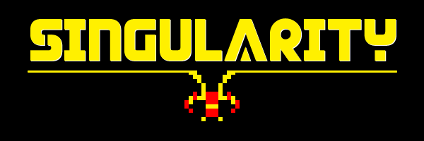
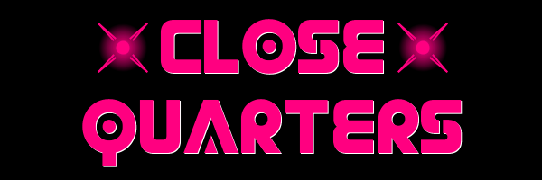
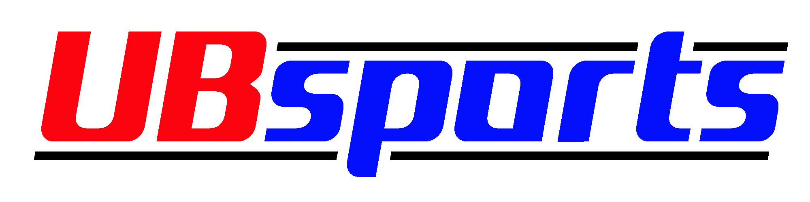
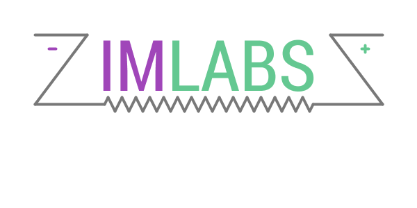
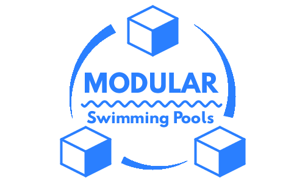

# Logos & Branding

Logo marks and brand assets, each one generated programmatically in [Processing](https://processing.org) (Java). Every mark in this collection is drawn by code — geometry, typography, and effects composed in a sketch and exported to PNG/SVG — rather than in a design tool.

## The Marks

### Singularity

Retro-arcade logotype for *Singularity*, my browser arcade game. Pixel-block letterforms with an 8-bit invader motif on the descender line.

### Close Quarters

Neon logotype for the *Close Quarters* arcade game — hot pink letterforms with glowing starburst accents, built with layered texture passes.

### UBsports

Athletic wordmark for UB Sports. Italic cut with speed-line accents in a classic red/white/blue scheme; delivered in dark and white-on-transparent variants.

### IM Labs

Circuit-inspired wordmark — the frame reads as a schematic, with polarity terminals on the shoulders and a resistor zigzag underline.

### Modular Swimming Pools

Badge concept built from isometric cubes orbiting the wordmark, echoing the modular product. Includes SVG explorations alongside the final PNG.

### Secret Weapon Signature Card

Animated email-signature card (name, role, phone) with a monogram badge — the sketch renders the card and exports it as a GIF. Contact details in the committed source are placeholders; set your own before exporting.

## How They're Built

Each folder contains the Processing sketch (`.pde`) that generates the mark, any fonts/textures it uses (`data/`), and the exported asset(s). Open a sketch in Processing and run it to regenerate or restyle a mark — colors, geometry, and type are all parameters in code.
